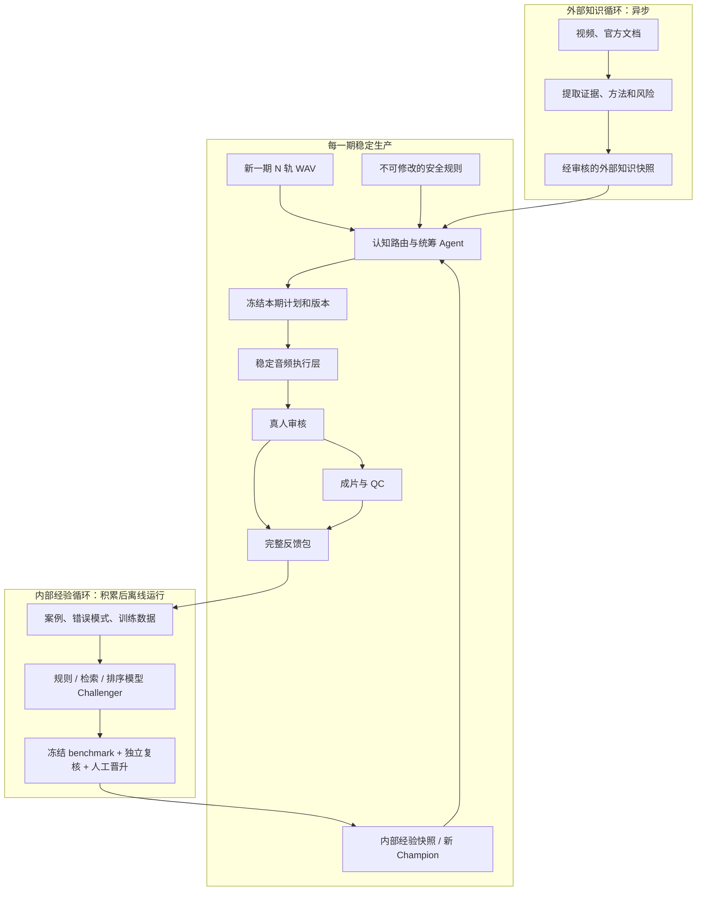

# 剪辑项目：全局统筹记忆

> 当前状态指针：当前 run、版本、审核数量和阻塞点只以《当前项目进度》中的 CURRENT_DELIVERY_FACTS 及自动生成的《当前状态摘要》为准。本文件只保存长期产品、架构和安全决定；文中的日期/run 记录是历史证据，按需读取。

> 更新时间：2026-08-17
> 作用：产品与架构的唯一长期记忆。它面向项目负责人和 AI，不保存逐次会话流水账、脚本清单或大段运行日志。

## 2026-08-17 EP04 本次机器试听草稿的窄授权

项目负责人明确授权：本次不要因历史逐项标签的 `source_audio/source_bundle` 身份记录不完整而阻断 EP04 成片试听；直接使用已确认真人标签、备注和已学到的剪辑偏好生成一份新草稿。该授权只适用于一个新、run-local 的 `machine_assisted_draft`：它可以引用同一期的已审事件作为机器证据，但每个动作必须保留来源、当前边界和授权 SHA。它**不得**写 `human_decisions.json`、`human_approved.edl.json`、`autocut_policy`、Champion 或外部发布；旧的防泄漏回测与跨节目门禁仍保持不变。

**明确的低门槛规则（已实际执行）**：本次首次本地试听不再等待新的逐项审核；负责人确认可信的同一期历史标签可直接给出机器“剪/保留”建议。机器只可剪入低风险、当前或已复用边界 `artifact_risk=OK` 的点；历史 `reject` 若仅指出剪辑痕迹或音量问题，必须先以当前干净边界修复，不能被误学成“语义应保留”。`BLOCK`、高风险、语义未知和跨轨冲突仍保留原样。输出永远标为 `machine_assisted_draft`，下一道人工门是整片试听，而不是伪造逐项新审核。

**实际交付**：`EP04-machine-assisted-draft-20260817-002` 已按此规则生成 3 个机器剪口（`C007/C034/C044`）、3 个机器保留、6 个留待迭代，并已渲染 WAV/MP3、音乐、EDL 与自动 QC（PASS）。它是当前最新的本地机器试听成品，不是人审版或发布版；精确文件和哈希见该 run 的 `MACHINE_DRAFT_REPORT.md` 与 `machine_draft_qc.json`。

## 2026-08-16 学习闭环架构决定

本项目已批准建立“事件账本 → 反馈归类 → 版本化政策卡 → Challenger 验证 → 人工晋升”的隔离学习闭环。它解决的是“同一音频事件被重复审核、备注没有转成可执行知识、ASR 错误与语义判断混在一起”的问题，不是在线训练，也不授权机器自行删剪。

- **事件账本**：以输入音频/轨道、归一化文本、时间重叠窗口和候选家族形成稳定 `event_key`。候选 ID、边界精修或 semantic SHA 变化不能单独制造新事件；边界变化必须另记 `boundary_review_required`。
- **反馈归类**：真人备注先归为 `asr_error`、`semantic_keep`、`semantic_cut`、`execution_issue`、`false_positive` 或 `unknown`，并保留原文、证据、案例和归类置信度。归类不是改写真人决定。
- **政策卡**：每张卡记录条件、行动、案例、反例、来源 case_id、版本、状态和适用范围。初始状态只能是 `challenger` 或 `candidate`，不能直接改 Champion、生成 `human_approved` 或授予发布权限。
- **三层文本**：`raw_text` 是不可改写的上游 ASR；`match_text` 只用于事件匹配、繁简归一和历史检索；`display_text` 只用于审核阅读。任何文本归一都不得改变词级时间戳、原始词 ID 或剪辑边界证据。
- **路由规则**：已审同事件 → 继承语义决定；边界明显变化 → 继承语义决定但升级执行复核；旧 `reject` 若为误报 → 抑制同类候选；旧 `reject` 若为执行问题 → 生成执行修复任务；未知事件 → 进入真人审核分层。
- **安全边界**：历史决定、备注、试听和 SHA 只读；机器预测与真人决定分离；验证过的政策最多进入 `machine_assisted_draft`，不能自动成为 `human_approved`。

**实际 Challenger 证据（2026-08-16）**：`LABEL-LEARNING-v2-20260816` 已降级为历史诊断证据：27 个 canonical case 被重复导入，且 manifest 后来失效，不能继续作为不可变依据。有效的当前证据是 `main/runs/LABEL-LEARNING-v3-20260816/`：65 条独立逻辑事件（24 accept / 41 reject；37 条不完整来源隔离）、20 张版本化政策卡和 EP04 v20 → label-loop 元数据回归。12 条当前候选中，3 条是“语义可复用但边界需复听”，2 条是“旧 reject 仅为剪辑执行问题”，其余 7 条仍是新事件。该运行不读音频、不改当前审核包、不生成 EDL 或自动剪辑授权；它证明的是学习证据链已经跑通，不是生产晋升。

**生产自动剪辑政策晋升检查（2026-08-16）**：`main/orchestrator/policy_promotion.py` 已把“政策卡 → autocut_policy”的门做成可复跑的 fail-closed 检查。独立封存证据在 `main/runs/POLICY-PROMOTION-v1-20260816/`，它冻结 v3 政策卡、readiness、规则建议与活跃保护规则的 SHA。当前结论仍为 `NOT_APPROVED`：有效案例虽有 27 条，但只有 2 期、1 位审核人，且独立 benchmark、独立复核、回滚演练和明确签署的低风险删除范围都缺失。20 张卡没有可授权自动语义删剪的条目；`POL-009-false_positive-ada507645c` 最多是“阻断已知 ASR/词边界误报”的保护规则候选，绝不授予剪切权限。用户的本次指令授权建立晋升机制，不等于为未指定内容签署无人值守删除范围。

**接入状态（2026-08-16）**：未来新 run 会由 `delivery_orchestrator.py start` 冻结 `editing-policy-guards-v1` 的 JSON/SHA，并写 `policy_application.json`。该活动规则只能 `auto_preserve` 已知完整词/词边界误报，或升级为 `human_review_required`；它绝不生成 `auto_cut_eligible`、EDL 动作或真人决定。未来新审核包也可由 `start --event-history-run <历史逐项人审 run>` 自动生成 `review_bundle/event_routes.json`；前端只把它显示为历史参考，且会校验同一 `review_manifest_sha256`。当前 `EP04-label-loop-v1-20260815-1805` 已有 `review_draft.json`，因此包内页面、候选、决定和侧车均冻结不动；同步检查改为验证该 run 自己冻结的 `review_bundle/index.html` SHA 与审核能力，而不是拿未来 canonical 页面回溯覆盖当前审核会话。

## 2026-08-17 标签学习驱动器同步决定

旧 `LABEL-LEARNING-DRIVER-v4-20260816` 只保留为历史证据：它没有绑定当时的驱动器源码、目标 `run_identity`，也没有冻结审核包/草稿的 before/after 哈希，因此其中的 1 剪 / 3 保留 / 8 人审不能继续代表当前行为。有效证据改为 `main/runs/LABEL-LEARNING-DRIVER-v5-20260817/`：驱动器源码 SHA、v3 快照 SHA、候选输入 SHA 和目标 run 身份均已封存；目标完整性 before/after 比较为 `PASS`；当前 shadow 对 12 条候选输出 0 剪 / 0 保留 / 12 人审。

普通 `delivery_orchestrator.py start` 现在默认加载 v3 快照，并在候选冻结前后自动调用驱动器；两次调用都必须绑定当前 `run_identity.json` 与 `input_manifest.json`。边界精修会合法改变候选源 SHA，因此 pre-review 侧车绑定精修前 SHA，post-boundary 侧车绑定精修后 SHA；两者都不得写真人决定、EDL、音频或 `autocut_policy`。项目 Skill 只是 Agent 路由说明，真正可验证的自动化是上述 orchestrator 调用和契约测试。

这仍不是监督学习模型或跨节目通用判断器：当前只有 2 期、1 位审核人、source bundle 身份覆盖 0/65，回测状态必须保持 `INSUFFICIENT_DATA_FOR_CROSS_EPISODE_GENERALIZATION`。

## 2026-08-17 案例记忆进入未来新审核链

`main/orchestrator/case_memory.py` 现从 run-local 冻结的经验快照，为每一条候选检索可解释的相似**逐项真人**案例。它输出 case ID、历史节目/run、当时的 accept/reject、备注、匹配理由、相似度与身份完整性；同 run、同节目、可证明同源 bundle 或同一音频的记录一律排除，避免把本轮或同源证据伪装成跨节目案例。旧案例若缺少音频身份仍可展示给审核人，但明确标为 `LEGACY_IDENTITY_INCOMPLETE`，不算独立跨音频证据。

普通未来 `delivery_orchestrator.py start` 会生成两份哈希绑定侧车：`case_memory.pre_review.json` 覆盖全量候选并提供低风险代表样本的审核优先级；`review_bundle/case_memory.json` 精确绑定本次 `review_manifest_sha256`，供网页与离线 `review_packet.md` 显示。高风险全审不受影响；低风险层先保留最短/最长时长边界样本，再用历史冲突/保留等优先级占用剩余代表性槽位，最后才按固定 seed 填充。前端遇到 manifest 不匹配即拒绝读取，`resume` 会复核两份侧车的文件 SHA、候选源、冻结快照、run/input 身份和审核包绑定。

案例记忆永远不创建本轮真人决定、不写 EDL、不授予 autocut 权限；它只是历史参考和审核排序信号。`test_case_memory.py` 3/3、集成契约 3/3、orchestrator 12/12（含优先级行为与篡改侧车拒绝）已通过。尚未用一份新的真实音频 run 验证，故不能把它说成已提升真实节目审核效率。已有 `review_draft.json` 的 `EP04-label-loop-v1-20260815-1805` 继续冻结，绝不补写案例侧车或刷新页面。

## 1. 一句话产品定义

这是一个**本地运行、可追溯、由真人掌握最终语义决定的多轨播客后期助手**。它减少检查、定位、试听、同步剪切和导出等机械劳动，让人只在语义和听感真正需要判断的地方花时间。早期样例以双轨为主，但产品契约从 2026-08-11 起按任意 `N` 条对齐单声道轨设计，不再用“男/女”写死轨道身份。

它不是无人值守自动剪辑器。当前最重要的产品指标不是自动化率，而是：

```text
净节省时间 = 原人工剪辑时间 - 审核时间 - 返工时间 - 系统维护时间
```

## 2. MVP 主流程

```text
N 轨 WAV（当前重点是 3 轨）
→ 输入检查 / 同步与漂移门禁
→ 降噪与时间线校准
→ 词级 ASR / VAD / 说话活动分析
→ 全量候选冻结与风险分层
→ 高风险全审 + 低风险代表性校准审核
→ 真人标签 + 机器预测（两者严格分开）
→ human_approved / machine_assisted_draft 双 EDL
→ 全轨同步剪切 / source-track gate / 混音 / 固定授权片头片尾
→ QC / 最终人听审 / WAV / MP3 / 反馈归档
```

MVP 真正完成的标志不是脚本跑到 ARCHIVED，而是一个真实用户用一整期真实节目完成：只输入音频、候选与风险分层、高风险全审/低风险校准、两种来源明确的渲染版本、固定音乐、整片听审、QC 和发布候选输出，并证明比纯手工流程节省净时间。

## 3. 总体架构



### 各层职责

| 层 | 做什么 | 当前状态 |
| --- | --- | --- |
| 认知层 | 判断输入类型、选择规则和知识快照 | 顶层 `SKILL.md` 仍是占位路由 |
| 统筹层 | 冻结计划、调用工具、管理人工暂停与恢复 | `main/orchestrator/delivery_orchestrator.py` 已接通输入、DeepFilterNet、P0、`filler-global-pause-v18` 候选、活跃 `editing-policy-guards-v1` 保护路由、审核包、校准、双 EDL/渲染/QC，以及默认自动刷新的 `editing-e2e-v1` development benchmark 旁路；默认 20 项审核预算与无前端审核包已接通，尚未接通全部候选类型、automix 或统一 Tool adapter |
| Tool 层 | 声明可执行能力和参数契约 | 注册表已登记 `build_case_memory`；DeepFilterNet 已由普通生产入口实际调用，其余能力仍未由同一 adapter 完整编排 |
| 执行层 | 真正处理音频、生成审核包和成片 | 多个阶段已有工程证据 |
| 人工审核层 | 高风险全审、低风险代表性校准；形成有效真人标签 | EP03 已完成 11 项、EP04 已完成 13 项真人双态审核并生成 EDL；EP04 口癖/长停顿另有 3 项已审，尚未生成该轮 EDL；分层校准与双 EDL 仍是目标契约，当前不做 `adjust` |
| 外部知识层 | 从公开资料形成可引用方法与风险 | 已有资料并冻结，本轮不扩展 |
| 内部经验层 | 从多期真实审核中改规则、检索或训练排序器 | 当前有效快照有 65 条独立逻辑事件；未来新 run 的案例记忆可检索相似真人案例并影响审核优先级，仍未训练模型 |
| Loop | 未来负责任务、闸门、审计、晋升和回滚 | 仅架构适配判断，未部署 |

## 4. 当前最重要的两项工作

### P0：听觉工具评测

目标是回答“机器是否把字、停顿、说话人和重叠听准”。2026-08-14 起已决定：**ASR 必须使用成熟的外部上游项目；本项目不训练、维护或伪装自研 ASR。**本项目只保留本地输入适配、原始结果留存、词级时间戳资格校验、统一 schema 和下游候选接口。当前已实跑的外部基线是 faster-whisper small；FunASR Paraformer 与 MLX Whisper 仍只在同一套人工 gold 下作 Challenger 比较，不能因“外部项目”身份跳过验证或直接替换基线。

当前状态：正式多引擎 benchmark 的 12 段人工 gold 仍为空，因此不得宣布哪套最准。最小 P0 已在 3 轨、每轨 20 秒的兼容夹具上实际运行：3/3 有逐词结果、非法时间戳 0、RTF 约 0.18–0.21。2026-08-11 又已用 EP04 的 3 条真实 Zoom H6 轨跑通：三轨均为 48 kHz / 24-bit / mono、共用同一 BWF sample timeline、各 3,272.7 秒；faster-whisper small 产出 12,848 / 12,526 / 7,732 个词。原始 ASR 中的 79 个零长度 token 已保留原文并以确定性、最多 20 ms 的边界修复生成 normalized 副本，三轨非法时间戳均为 0。随后 `EP04-v13-20260813-2002` 以当前生产输入重新生成三条 normalized 词级转写，分别为 12,467 / 11,853 / 6,732 个词，非法时间戳仍均为 0。专名和文本准确率仍没有人工 gold，只能作为候选与审核底稿。

**ASR 成果复用规则（2026-08-14）**：后续 Agent 必须先查找并验收已有 ASR，不得因为新建了 run 就重复转写。只有当原始 WAV SHA、实际送入 ASR 的音频 SHA、外部引擎/模型快照、设备/量化/解码参数，以及 transcript 的 `source_audio_sha256` 和报告 SHA 全部一致时，才可直接复用词级 JSON、normalized transcript 与 semantic transcript；候选规则或审核页面变化只重跑下游。当前已验证的 EP04 上游是 `EP04-v13-20260813-2002` 的 `faster-whisper small`（CPU int8，模型 revision `536b0662742c02347bc0e980a01041f333bce120`）。若降噪输出 SHA 变化，旧 transcript 不能冒充新音频结果；要么明确冻结旧降噪轨+ASR 作为本次候选上游，要么对新降噪轨重跑同一模型，并把 `reused_from_run` 与每轨 SHA 写入新 run。

**复用入口已真实验证（2026-08-14）**：`delivery_orchestrator.py start` 现在支持 `--reuse-analysis-run` 与显式 `--reuse-semantic-run`。当同一份 P0 报告有多个语义上下文归档时，入口 fail closed，不按文件名猜选；复用前逐轨校验 raw、DeepFilterNet、transcript、semantic 文件与报告 SHA，并禁止同时传入新的 `--model` 或 `--context-prompt`。这道门已在 `EP04-v20-20260814-1617` 的候选-only 运行中真实验证：日志没有重复调用 DeepFilterNet 或 P0/ASR。当前唯一仍处于待真人审核的 run 是 `EP04-label-loop-v1-20260815-1805`；v20 是已完成候选审核/技术渲染的历史参考，v17–v19 仅保留为被替代/失败的工程证据，不能继续审核或恢复。

**审核产品与文档同步门（2026-08-14）**：v20 首版审核页曾回退为只显示原始逐词流，并丢失 Claude 旧页面的逐项 `feedback`。现已在同一 v20 run 内通过 `refresh-review` 归档旧 `review_bundle`，从同一 `calibration_source.json` 重建；候选 ID、轨道和 sample 边界保持不变，修订证据见 `review_package_revision.json`。当前审核页消费 semantic sentence/clause 作为明确标注的阅读辅助层，同时保留原始词级 ASR 证据；`feedback` 通过草稿、正式决定、反馈包和经验案例链路透传。审核包还必须携带并可见地显示本次 `run_id` 与冻结的 `review_scope`：候选规则版本、候选置信度、风险路由和当前交付版本是四个不同概念，前端不得混写。以后任何前端/审核字段/文档变更都必须遵守《版本同步与交付事实门》，并运行 `check_current_delivery_sync.py --check`；未通过不得称为最新版本。

**上下文持久化与音乐硬要求（2026-08-14）**：用户的最新明确要求必须在收到后立即落入 `当前项目进度.md` 的结构化事实、当前 run 的 `requirements_checkpoint.json`、功能契约和可执行配置，不能等聊天结束或依赖上下文摘要。EP04 v20 当前固定 `reference-linear-v1`：`0–5.000 s` 纯音乐，语音在 `5.000 s` 精确进入，音乐于 `5.000–16.000 s` 线性淡出；片尾提前 `22.000 s` 淡入，语音结束后保留约 `37.976 s`。历史 v12 的 `12 s` 入声只允许作为历史对比，不得由普通 `start` 选择。自动上下文压缩无法被项目代码可靠拦截，因此任何交接、长任务、版本宣布或可能发生压缩前，都必须先更新检查点并运行同步检查；检查失败即停止。

2026-08-14，负责人对 EP04 做了两段主观抽听：约 `01:00–01:30`，中文主体被确认准确，英文术语仍有问题；`47:37.5–48:10.5` 的中英混说术语密集片段（含 `MCP`、`DeepMiner`、`OpenClaw`、`CC`、`Codex`、`agent`）被确认识别良好。这个结果支持把当前转写用于口癖、长停顿定位和人工审核底稿；它不是人工 gold，不构成整集准确率、英文/专名准确率、说话人能力或多引擎胜负结论。

同日新增并归档 `semantic-transcript-v1` 句子/分句上下文层：来源为 `EP04-v13-20260813-2002`，运行目录为 `main/runs/EP04/EP04-semantic-transcript-v1-20260814-120456/`。三轨分别生成 177/207/170 个句子、769/803/408 个分句；每个输出的 `word_context_index[word_id]` 都能回到原始词的 `sentence_id`、`clause_id`、位置和 sample 范围，且原始 `word_id`、顺序和覆盖校验均为 true。它的 `timing_text_heuristic_v1` 只是假设层：源标点可标高置信度，停顿/文本启发式边界均为低置信度；它不是可靠标点模型，也不是语言理解模型。

这个派生层不改写词级 ASR、时间戳或剪口，不生成候选、不判断 `accept/reject`、不生成 EDL、不改音频。后续“该不该删”必须由独立候选/删剪判断模块消费 `sentence_id + clause_id + 原始词上下文 + 声学停顿`，并继续遵守真人审核边界。来源 P0 的 `quality_gate` 仍为 `WAITING_FOR_SMALL_HUMAN_SPOT_CHECK`，所以本层证明的是结构完整性和可追溯性，不是整集 ASR 或标点质量验收。

2026-08-13 项目负责人明确选择 DeepFilterNet `v0.5.6` **直接替代**旧降噪方案。官方 arm64 CLI 以本地 SHA `4601e7f4e4c03e59a4c5b5000216ef3add3e808799cfccd95e14e83ea4611081` 固定在本机忽略目录；所有普通新 run 会先生成 run-local DeepFilterNet 轨，再供 ASR、审核试听和渲染使用，原始 WAV 不覆盖。`afftdn` 仅保留为历史 run 的可复现证据，已从当前 Tool 注册表和普通 `start` 流程移除。上游 `--compensate-delay` 固定少 1,440 samples（30 ms），适配层以原始末尾 30 ms 回填；合成双轨、EDL 绑定与双渲染均实测等长。EP04 已实际生成两段真实三轨、各 30 秒的 DeepFilterNet 试听，全部等长并可解码；**真人 A/B 结论与整片听审仍待完成**。预训练模型权重的商用许可证仍未明确，二进制仅有 ad-hoc 签名。详细证据见 `稳定生产/challengers/review-product-v1/audits/deepfilternet.md`。

### P1：审核产品闭环

目标是让真人快速、安全地完成审核并记录真实审核时间。当前文本优先 MVP 只开放 `accept / reject`；`adjust` 因缺少完整的重生成试听闭环而明确禁用，边界不合适就选保留。页面只显示候选来源的原转写和拟删文字，试听改为可选，不再阻塞选择；是否试听仍写入决定记录。

当前状态：EP03 已完成 11 项真人双态审核。EP04 已通过通用 N 轨桥接重建审核包：80 个原始重复命中中 48 个因其他轨出现冲突文字而被阻断，余下 13 项均交给真人；26 个真实三轨 A/B 文件通过哈希校验。熊镇正已完成 EP04 的 13/13 项审核：6 项 `accept`、7 项 `reject`，后端生成 6 个同步作用于 3 条轨的剪切区间，共删除 138,240 samples（2.88 秒）。该 EDL 已实际渲染出 3 条 edited stem、speech mix WAV 和 192 kbps MP3，格式与响度 QC 已落盘。EP04 口癖/全轨长停顿独立页的 3 项审核也已完成（2 项采用、1 项保留），但该轮尚未生成新的 EDL 或渲染。2026-08-13 的 EP04 v4 又把历史标签外推为 122 条机器决定：30 条同步剪、92 条源轨 gate，并生成含音乐 WAV/MP3；其 reviewer=LEARNED_FROM_HUMAN_v4、review_mode=learned_thresholds_v4，不是逐项真人审核，故只能标为 machine_assisted_draft。随后 EP04 v12 用原始三轨实际试跑了更细的口癖、长停顿、瞬态、音乐和两遍响度归一化偏好；其旧 manifest 仍保留 `EP04-v4` 身份和旧绝对路径，故该历史 run 继续只作 Challenger 偏好/工程证据。用户在当前任务明确听完整片并批准其冻结动作范围后，已新建 `main/runs/EP04/EP04-human-approved-v12-20260813-152847/`：它重新绑定输入、输出、双 EDL、音乐和 QC 的 run identity，并以 `human_whole_episode_audition` 留存批准范围；它不制造逐项人审标签、不改 v12 历史 run、不改变 autocut_policy。当前仍没有有效 autocut_policy；常规机器预测不得进入 human_approved 或发布候选。固定音乐素材与 `reference-linear-v1` 时序基线已冻结；EP04 这次批准使用 v12 交叉音乐作为**本期**听审选择，不静默替换默认模板。主麦 automix、音乐增益/ducking、完整候选覆盖和跨期发布规格仍未完成。

2026-08-13 又完成 `filler-global-pause-v13` 的工程收口：完整句子里的单个弱口语词和普通单个“嗯”默认保留；只有短促连续弱词、较长或同轨密集的“嗯”才提名；全轨长停顿只做分档自然压缩 A/B，不删成零停顿。Mentor round 2 的 D3/D5/D7/D8/D9 曾冻结为 Challenger `filler-global-pause-v16`；当前普通 `start` 的生产候选默认已更新为 `filler-global-pause-v18`，并继续使用 `--review-budget 20`。高风险超过预算即 fail closed，低风险代表样本不足则未剪并回到 `human_review_required`。每次 run 还生成 `review_packet.md` 与不可直接提交的 decision template，审核人无需见到前端。一个可删除的三轨 30 秒 PCM fixture 已实际跑完 `start → 审核包 → 人工决定 → resume → 双渲染/音乐/QC → record-final → verify`；候选/审核包/FFmpeg 为真实本地调用，但降噪和 ASR 在该 fixture 中是明示的假 adapter，因此仅证明编排和证据链，不能替代真实节目质量或人耳验收。

2026-08-12 已对上述二态口径完成独立复核：`experience-ingestion-v1` 的当前有效快照为 `case_store/two-state-v1-20260812-1627/`，实际导入 27 条逐项案例、排除 26 条 bulk accept、quarantine 为 0；20/20 标准库契约测试通过。首轮旧 baseline 检出 EP04 口癖/长停顿审核文件 SHA 漂移并 fail-closed；在逐字段确认三条决定的语义投影未变后，才以独立 two-state baseline 重跑。该快照只授权案例检索和 Skill/规则分析；不授权训练、改生产规则或自动批准 EDL。

P0 和 P1 均属于隔离 Challenger，未覆盖 Champion。当前只是为当日 MVP 建立了可运行的小闭环；正式晋升仍需要人工 gold、真人审核和完整节目验收。

### EP04 v12 QC 补充

正确身份的 EP04 v12 交付 run 已用一个 SHA/版本留痕的本地 FFmpeg 对冻结母带独立重测，实测为
`-16.54 LUFS / -0.86 dBTP`。这只是本期音频的客观观察：v12 的 `-16 / -1` 工作目标和该二进制
本身都尚未构成 Mentor 冻结的跨期发布规格或已审计部署依赖；它不改变 `autocut_policy = NOT_APPROVED`。

### 轨道、说话人与性别的产品约定

核心管线只要求稳定的 `track_id`（物理轨道）以及“本段哪一轨是主讲话、哪一轨是串音/重叠”。**性别不是同步、转写、候选安全、全轨剪切或训练的必需字段，也不应由文件名或音高自动猜测。**

为方便真人辨认，可在输入清单中人工补充 `speaker_id / display_name / role / mapping_source`，例如“黄楠 / 嘉宾 / 人工确认”；未确认时就显示“物理麦 A/B/C”。混音若要按人声差异处理，应依据实际响度、频谱和听感，而不是按男女套固定参数。

当前 EP03 页面中的 `female / male` 只是旧文件和内部 source key 的历史标记，不代表 AI 已正确识别男女。两轨出现大量相似文字，主要因为两个物理麦都收到了同一讲话者的房间串音；后续真正要提高的是主讲/串音/重叠和人物映射，而不是先做二元性别分类。

## 5. 关于“监督学习”的准确定位

**已验证事实：当前不是监督学习模型系统。**现在存在的是规则驱动候选生成、人工二态数据结构，以及已经真实运行的“事件账本 → 备注多标签归类 → 政策卡 → 生产保护规则/晋升门”Challenger；没有训练脚本、loss、optimizer、模型权重或可以在线自动改生产规则的学习 Agent。

两类“学习”必须分开：

- 外部学习是知识工程：把视频与官方文档变成带来源、适用范围和风险的冻结知识卡。
- 内部学习才可能成为监督学习：当前先使用候选及上下文与人工 `accept / reject`；未来如恢复 `adjust`，才额外拥有调整后的 sample 边界。

P0 负责让输入可信；P1 负责产生可信标签；内部经验循环以后才负责真正学习。旧 `bulk accept` 只证明链路可运行，不能作为训练标签。

演进顺序：

```text
真实逐项审核记录
→ 案例检索与 Skill / 规则总结
→ 规则和阈值改进
→ 相似案例检索
→ 候选策略和风险排序
→ 小型二元候选排序模型
→ 数据和 benchmark 足够后再考虑更重训练
```

每个经验总结先进入项目内 `skills/editing-experience-distiller/`：它读取当前有效案例快照，输出带 case_id 的经验卡和新的 Challenger 假设，不直接执行音频删剪。任何新经验只进入 Challenger：

```text
新数据 → Challenger → 冻结 benchmark → 独立复核 → 人工晋升 → Champion / 回滚
```

生产 Agent 禁止在线自我修改。

### Benchmark 与 Skill-first 路线

ASR 不自造大考试：优先用成熟公开中文语料筛选引擎（基础转写、多人会议/重叠、长音频泛化），再用本地人工 mini-gold 做领域校准。剪辑质量以一整期 `raw N 轨 → 系统版本 → 人工最终成片` 的端到端回放为主，比较诊断覆盖、整片盲听与净节省时间。公开基准、端到端集和功能入口详见 `功能说明/F10-基准、能力目录与Skill路线.md` 与 `能力目录.md`。

**审核效率的新增要求（2026-08-14）**：不能把“本轮只剩 5 条候选”直接解释为系统已经足够可靠。未来要让 Mentor 少看、而不是少发现问题，必须并列记录：候选/节目小时、分层前 K 命中、随机无候选区域抽查发现的漏剪、已采用剪口的盲听痕迹率、严重语义误删、审核/返工/维护时间。EP03、EP04 的既有决定和带备注审核只作 development 回归集；下一期独立节目才可成为 frozen 集。客观跳变/频谱指标只负责把最可疑剪口排到前面，不能替代人耳或授权自动删剪。

**持续 benchmark 硬要求（2026-08-14）**：每次候选冻结后，Agent 必须以只读方式更新 `benchmark/editing-e2e-v1` 的候选负担、固定随机的无候选区域抽查计划和历史备注回归；每次渲染后，必须保留剪口客观异常的优先复听排序；真人的无候选区结论、剪口盲听、整片听审、返工和工时再回填 development scorecard。这个循环的目标是用证据降低不必要的人工审核，**不是**把额外 QA 偷偷塞进 Mentor 的少量语义审核包，也不是把低候选量、声学分数或 `NOT_MEASURED` 写成自动删剪许可。公开语料与优秀节目/YouTube 资料只能补充评测方法和工具筛选，不能替代本地真人剪辑判断。

**持续 benchmark 自动入口（2026-08-14）**：上述旁路现已由 `delivery_orchestrator.py` 默认接到 `start`（候选冻结）、`refresh-review`、`resume`（渲染后）和 `record-final`；每次调用 `benchmark/editing-e2e-v1/run_development_benchmark.py`，只处理 run/benchmark 的 JSON 与 Markdown，并将 `benchmark_evidence.json` 与命令日志写回本 run。它可用 `delivery_orchestrator.py benchmark --run-dir <run>` 显式刷新真人 QA 回填后的派生 scorecard。benchmark 错误绝不能改变交付状态、真人决定、EDL 或媒体；必须如实写为 `BENCHMARK_EVIDENCE_UNAVAILABLE`。v20 已实际通过这个显式入口，仍处在 5 项真人审核前，故该证据不代表质量通过。

## 6. 永久安全边界

1. 原始 WAV、Mentor 成果、正式 Champion 和已哈希产物只读，不覆盖。
2. 公司音频、转写、候选文本和内部资料默认只在本地处理。
   2026-08-13 项目负责人已明确授权将**非媒体**项目材料（代码、文档、转写、候选、审核与 run
   元数据）同步到指定私有 GitHub 仓库；原始、试听和成片等真实音频/音视频媒体继续只留在本地，
   并由 `.gitignore` 阻断。此为明确授权例外，不改变“默认本地”的原则。
3. 改变语义的删剪必须由真人逐项明确批准，或由负责人对一个具 SHA 的冻结整片试听包明确批准，或由负责人签署、可回滚且范围明确的 autocut_policy 授权低风险机器剪口；后两者都必须保留各自 provenance。Agent 不得自批准、超时批准、默认全接受或把机器预测写成人工标签。
4. EDL 使用整数 sample，批准区间同步应用于全部语音轨。
5. 审核包、试听、转写、候选、EDL 和源文件必须版本化并绑定哈希；run 目录、
   `run_identity.json`、文件名和所有 manifest 的 episode/run 身份与相对引用必须一致，
   不一致即 fail closed。
6. 新工具和模型先审许可证、依赖、数据流、遥测、版本和 SHA，再进入隔离 Challenger。
7. Challenger 不得直接覆盖 Champion；晋升必须有冻结 benchmark、独立复核和回滚。
8. 当前 MVP 不含视频剪辑、TTS、AI 音乐、自动发布和无人审核的高风险语义删除。机器辅助试听草稿可以存在，但必须与人审版分开。
9. 多轨长停顿不得从单轨空白推导；只有全部轨道共同无转写活动且逐轨声学安静时才能提名，并应保留自然停顿。此类听感候选必须由真人听完原音频与压缩后 A/B 再决定。
10. “剪辑偏好快照”只能影响候选、排序和试听渲染参数；它不改变风险等级、不创建 `human_accept`、不等同于 `autocut_policy`，也不得让 Challenger 的单期参数覆盖 Champion。

## 7. 事实表达规则

所有结论必须属于一类：

| 标记 | 含义 |
| --- | --- |
| **已验证事实** | 已真实运行、检查或人工确认，且有文件或测试证据 |
| **已决定的方向** | 团队当前选择，但尚未完成部署或量化验证 |
| **待验证假设** | 合理推测，仍需真实数据或用户试验 |

静态代码就绪、自动测试、真实数据运行、真人听审和正式产品验收是五种不同证据，不能互相替代。

## 8. 当前完成定义和下一顺序

当前最短路径：

1. 用新的真实 WAV 按 V13 入口完成独立全程复核；继续把 `delivery_orchestrator.py` 从已接通的口癖/全轨长停顿范围扩到全量候选、风险分层、代表性审核、机器预测、双 EDL、双渲染和 DELIVERY_REPORT。
2. EP04 v12 的冻结整片已获人听审批准并已正确封装；仍需对其它 EP04 技术试听版、候选召回和无候选区域抽查复核，且不得把本次整片批准范围改写成逐项训练标签或自动政策。
3. 在 `reference-linear-v1` 与 v12 交叉音乐试听候选之间完成一次明确选择，再补主麦选择、串音抑制和 N 轨 automix；冻结目标 LUFS、true peak、MP3 与音乐增益/ducking。
4. 并行补 P0 公开语料筛选、本地人工 gold、更多候选类型和多引擎比较；adjust 暂不做。串音、咳嗽/碰麦与说错重来候选继续留在各自 Challenger，不得覆盖现有模块。
5. 先把真实案例总结为 Skill/规则并在端到端 benchmark 上验证；只有多期有效标签、有效政策和独立复核后，才启动内部经验学习和 Loop 控制平面实验。

## 9. 文档体系

- `README.md`：给项目负责人和 Mentor 的一页入口。
- `统筹全局/全局统筹记忆.md`：本文件，长期产品与架构。
- `统筹全局/当前项目进度.md`：唯一当前进度表。
- `统筹全局/产品要求与验收标准.md`：MVP 要求与完成门。
- `统筹全局/当前剪辑偏好快照.md`：最新已知剪辑偏好与适用范围；只影响候选/试听，不授予自动删剪权限。
- `统筹全局/功能说明/Fxx-*.md`：每个可独立验收功能的说明。
- `统筹全局/能力目录.md`：现有 Skill、Tool、脚本、库、Challenger 与入口。
- `skills/editing-experience-distiller/`：从逐项真人案例提炼经验卡和 Challenger 假设的项目内 Skill。
- `benchmark/`：ASR 公共筛选、本地人工 gold 与端到端剪辑 benchmark；不复制真实音频。
- `统筹全局/学习路线-监督学习与Skill.md`：面向项目负责人的学习路径。
- `与AI的上下文/当前项目上下文.md`：AI 跨对话的整体摘要。
- `归档/`：旧会话、旧进度和历史报告；默认不读，不作为当前事实来源。

新的产品或架构决定更新本文件；新的实施状态更新《当前项目进度》及对应功能文档；详细命令、日志和哈希只放在相关 run 或 Challenger 目录。

> 2026-08-15 的 `EP04-v22-20260815-1315` 是历史工程证据，不是当前审核指针。当前审核事实只读《当前项目进度》的 `CURRENT_DELIVERY_FACTS`：截至 2026-08-16 为 `EP04-label-loop-v1-20260815-1805`，状态 `CALIBRATION_REVIEW_REQUIRED`；其空白草稿不得当作新标签来源。

## 2026-08-17 新增：真人标签自动刷新经验快照

负责人确认：已有逐项标签均来自本人审核，可作为**可信的人审来源**。这解决的是来源可信度，不等于可以凭文件名补造缺失的音频身份；无法从现有 manifest 证明 `source_audio_sha256` / `source_bundle_sha256` 的记录，仍只能作为规则诊断证据，不能用于防泄漏的跨节目泛化证明。

每次有效标签保存（`/api/save` 中真实具名审核人的至少一条 `accept/reject`，不是 pending 草稿）现在必须触发以下事务：

```text
写入 review_draft.json，并抽取只含有效标签的 human_decisions_and_feedback.live.json
→ 新建唯一 LABEL-LEARNING-AUTO-* run
→ 在该 run 内冻结本次 live 标签源文件
→ 从全部逐项真人决定重建不可变 preference_snapshot
→ 生成防泄漏回测（数据不足也要留下明确状态）
→ 通过 SHA/结构检查
→ 原子更新 active_label_learning_snapshot.v1.json 指针
→ 后续新 start 自动读取该指针
```

指针是唯一可替换的“活动入口”；快照目录和本次决定只读，历史快照不覆盖。内容 SHA 只覆盖候选、候选语义 SHA、accept/reject、具名审核人与备注；浏览器自动保存产生的 session 时间、试听时间和 metrics 不会重复制造快照。若刷新失败，草稿与 live 标签侧车保留、活动指针保持旧值；下一次相同有效保存必须重试。若同一具名审核人把该包已有的全部有效标签都改回 `pending`，系统会先冻结当前草稿与被撤回的 live 标签、在新快照中排除旧标签；只有新快照和回测都成功后才删除 live 标签并原子切换指针。切换失败会恢复旧 live 标签，不能让已撤回标签残留在下一期经验中。最终 `/api/submit` 仍对完整决定作一次严格复核与 EDL 保存。自动刷新只影响未来审核排序、历史参考和保护性 `auto_preserve / human_review_required`；不得写入当前审核包、`human_approved.edl.json`、音频或 `autocut_policy`。

**实际回填（2026-08-17）**：负责人明确授权将已审核标签投入学习层后，系统以 `EP04-review-product-v2` 的熊镇正 13 条逐项决定（6 accept / 7 reject）触发真实本地 backfill，生成 `LABEL-LEARNING-AUTO-HUMAN-BACKFILL-20260817-001` 并写入活动快照指针。随后对冻结的 `EP04-label-loop-v1-20260815-1805` 做只读 shadow，目标 run 的 before/after 完整性为 `PASS`；结果仍是 0 条机器建议剪、0 条机器建议保留、12 条必须人审。这个结果说明 Agent 已实际读到人审经验，但当前证据不足以授权减少审核或自动删剪。

## 2026-08-17 英文术语准确性门

`faster-whisper small` 是当前生产 ASR，EP04 既有中文结果继续复用。英文术语不能靠主观印象宣布“整体准确”：同一音频、同一模型和其余解码参数固定，隔离比较 `language="zh"` 与 `language=None` 两臂；使用真人确认的英文/专名清单统计术语完整命中、漏识别、错误拆分和中文回归。没有术语级 gold 前，`auto` 只能是 Challenger，不能覆盖生产 transcript。纯英文 `.en` 模型不作为中英混说默认模型。

## 2026-08-17 主麦自动混音定义

主麦自动混音（main-mic automix）是**混音层**的音量自动化：根据当前哪条物理麦克风更像主讲话轨，适度压低其他轨的串音，再把主轨保持在稳定电平。它不改变时间轴、不判断句子是否该删、不生成候选，也不替代全轨同步剪切。它可能产生“忽大忽小”的 pumping，或误压低“嗯/对”等回应，因此必须保守，并与语义删剪、串音 gate 分开记录和验收。
