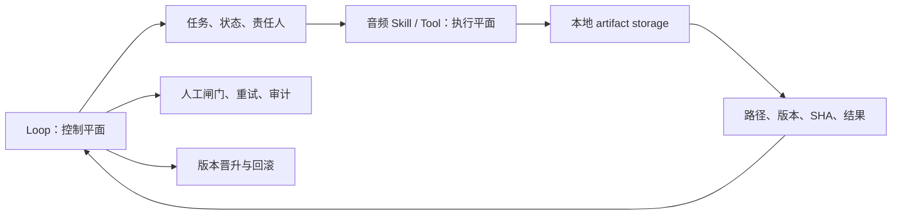

# F09 Loop 控制平面

## 功能目的

未来用 Loop 管理一期节目的任务流转、Agent 分工、人工闸门、失败重试、artifact 引用、Challenger 晋升和回滚。Loop 不负责直接处理音频。

## 正确分工

Loop 中只保存任务状态、路径引用、版本、哈希和决策；音频、转写、试听和模型产物保存在本地 artifact/data storage。

## 可映射的流程

1. 新节目事项：登记素材、授权和目标规格。
2. 冻结执行计划：选择规则、知识快照和 Tool 版本。
3. 音频执行：本地工具生成审核包。
4. Review：检查材料、风险和 QC 是否准备好。
5. 真人闸门：批准、拒绝或调边界。
6. 渲染与归档：输出成片、QC、反馈包。
7. 离线学习：Challenger 评测、人工晋升或回滚。

## 当前状态

### 已决定的方向

Loop 适合作为控制平面，音频 Skill/Tool 是执行平面。两者应通过清晰的数据契约和 artifact 引用连接。

### 尚未验证

- 没有已验证的 Loop runtime 集成；
- 没有用 Loop 跑过完整一期；
- 吞吐、Token/算力成本、失败率、维护成本和审核工时均未知；
- 多 Agent 是否比单一统筹入口更高效尚无证据。

## 为什么现在不优先部署

当前核心瓶颈是输入是否听准、审核是否高效、成片是否被人认可。若本地 P0/P1 和真实产品闭环还未稳定，先接 Loop 只会把不稳定步骤编排得更复杂。

## 启动条件

- P0/P1 集成和完整 EP03 产品闭环通过；
- Tool 契约稳定，orchestrator 已能本地真调用；
- artifact 路径、SHA、状态和人工闸门 schema 明确；
- 已有可比较的人工工时与失败率基线；
- Champion/Challenger 与回滚在本地演练过。

## 验收标准

- Loop 能创建一期任务、路由阶段、引用本地产物并在人工审核处可靠暂停；
- 失败有明确重试上限和人工升级；
- 不把二进制素材塞进任务系统；
- Challenger 不能绕过人工晋升；
- 相比本地单入口，端到端时间、失败率或管理成本有可量化改善。

在这些指标出现前，只能说“架构适配”，不能说“已经高效”或“已经接入”。

